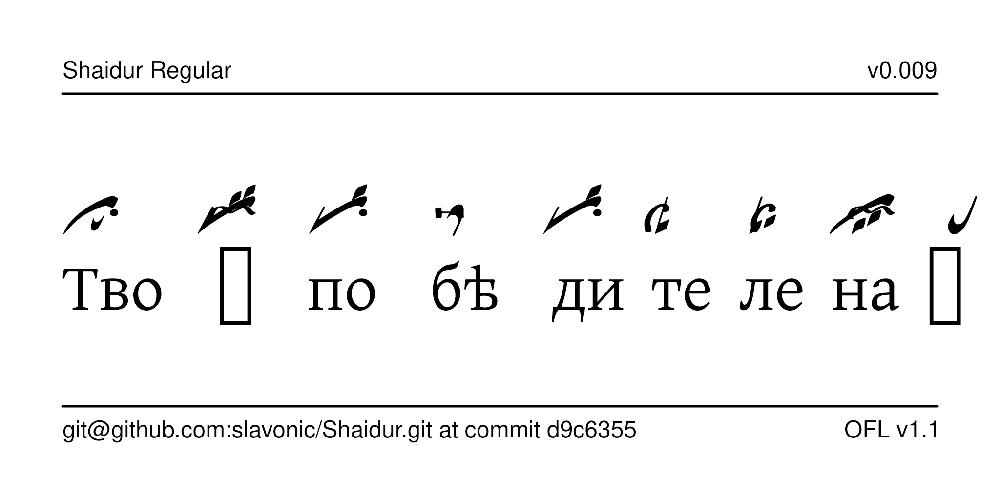

# Shaidur Typeface

Shaidur is a font for typesetting Znamenny Notation.



The font is named after Ivan Shaidur, credited with creating the cinnabar marks.

The font is intended for typesetting Znamenny Notation without priznaki (Type B notation).

## History

Mezenets was designed by Nikita Simmons ...

## License

This Font Software is licensed under the SIL Open Font License,
Version 1.1. This license is available with a FAQ at
[https://openfontlicense.org/](https://openfontlicense.org/).

## Building the Fonts

The font source is stored in a FontForge SFD file in the `sources/` directory. All modifications should be made in FontForge, resulting in an updated SFD file. This file is then converted to UFO format by running the `convert.sh` script. From terminal:

```
cd your/local/project/directory
./convert.sh
```

Since FontForge does not natively support COLR/CPAL, the `convert.sh` script also creates some additional UFO files for the color functionality. This is presently buggy and may be changed in the future.

The font can then be built using fontmake and gftools by running:

```
make build
```

Note that this requires Python and will install all of the necessary libraries and tools into a virtualenv at `venv/`.

To delete the virtualenv and the results of the build, run:

```
make clean
```

To build the sample image the sits at the top of this README, run:

```
make images
```

The command `make update` updates the repository and Python dependencies and should be run periodically.

Google's master repository also had a GitHub workflow for building the fonts in the cloud on push, but this seems to always fail because of incorrect dependencies, so it has been disabled. Instead, built binaries are stored on GitHub in the `fonts/` directory.

Because Google Fonts does not correctly support OTF fonts with color, only TTF and WOFF formats are built.

## Features

TODO

## Regression testing

The font is quite complex because of the various ligatures and multiple layers of diacritical marks controlled by anchor points, not to mention the use of color. If you change anything in the font, you must run the regression tests and make sure that the OpenType features have not been corrupted:

```
make regtests
```

This creates a file called `test-results.pdf` that displays the results of the tests. Note that running the regression tests requires LuaTeX and ImageMagick and takes a long time. It will compare your results against the baseline files used for regression testing, stored in `regtests/baseline/`.

Note that the baseline files are created using the command:

```
make baseline
```

but you should only do that if you are the project maintainer.

## More Znamenny Fonts and Tooling

See the [main repository](https://github.com/slavonic/fonts-znam/) and the [website](https://sci.ponomar.net/music.html).
